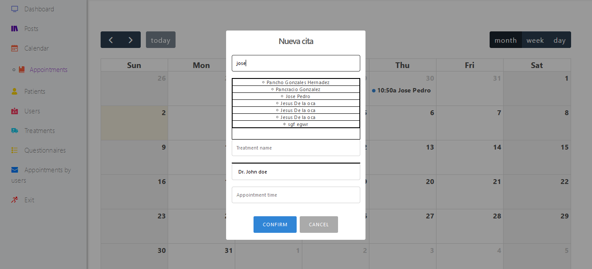
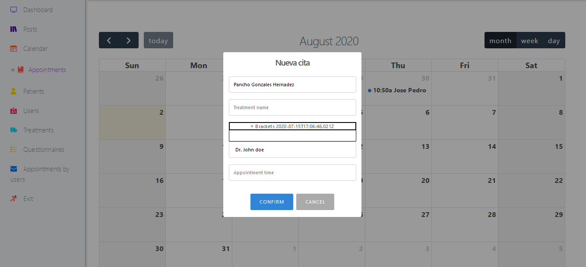
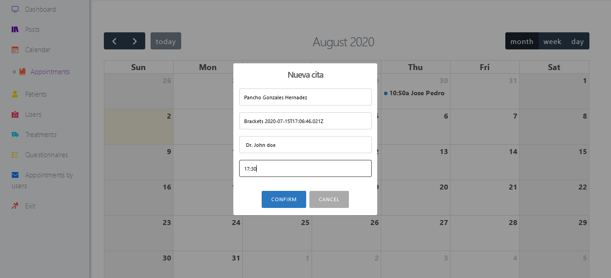
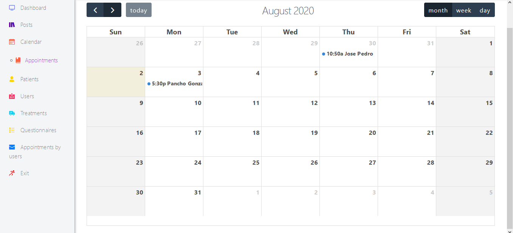
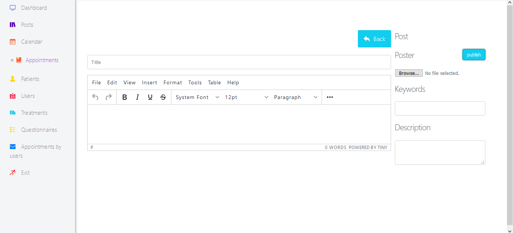
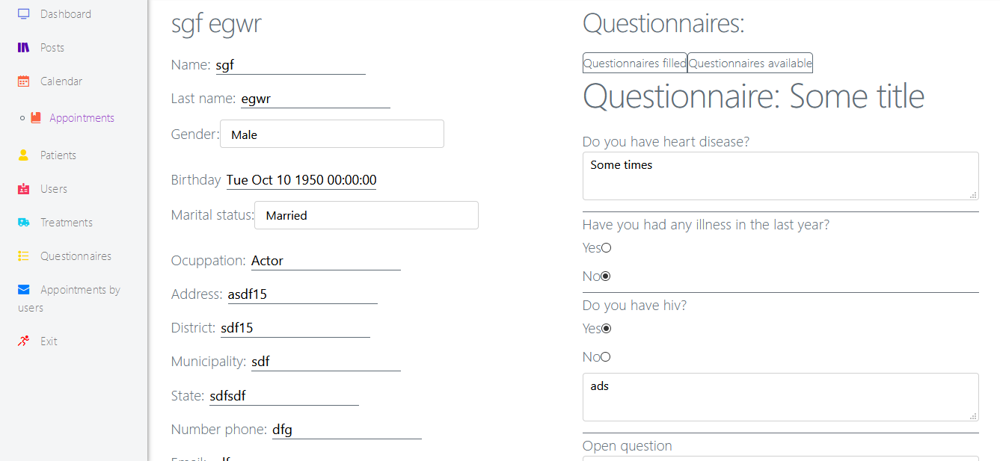
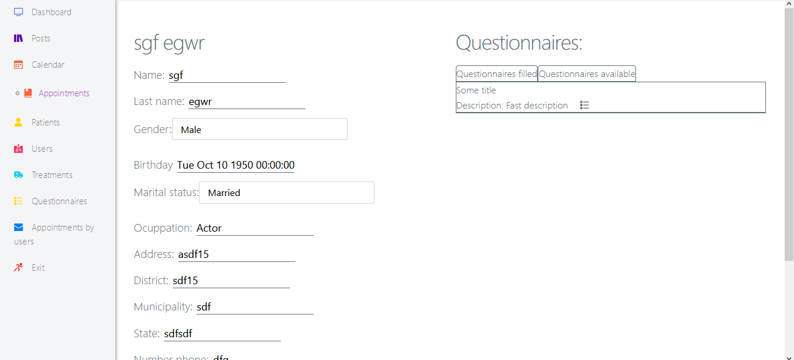

## Table of contents
* [General info](#general-info)
* [Technologies](#technologies)
* [Setup](#setup)

## General info
* This program is a web page for dentists.
* You can handle better your patients.
* You can set your appoinments using a calendar.
* You can use odontograms and add notes to every single appointment

## Technologies
This project is created with:
* express.js: 4.17.1
* MongoDB: 4.0.3
* Fullcalendar: 5.0
* TinyMCE: 5.0
* sweetalert2: 9.17.1
* Milligram: 1.4.1

## Setup
You need to install all dependencies:
```
npm install
```

You also need to have at least the superuser in your users collection, Example:
```
"firstname": "John",
"lastname": "Doe",
"email": "email@email.com",
"password": "$argon2i$v=19$m=1024,t=1,p=1$QjF1NzQwMmpoYlZQY0RWSGY1TGNnc0l2Vw$sTP6RHoszHGbc7O6TKeFhKZm0vrvaZQy",
"privileges": "superuser",
"gender": "male"
```

## Images







